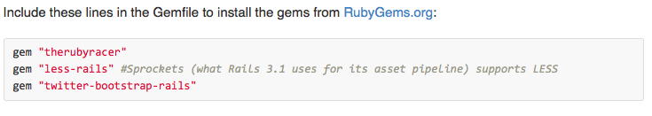

<h1>Epic Twitter Bootstrap Fail && other useful tips</h1>

This README is intended to be a resource for debugging your twitter-bootstrap install using Railscast #328. May the SCHWARTZ be with you.

By [Derik](https://twitter.com/Derikulous)

## Description
**Using Twitter Bootstrap with Railscast #328 & Rails 4**

Twitter-Bootstrap is simple to implement, right? Add some gems to your gemfile, install it via command line, and voila! you're off to UI godliness. After all that head-scratchin' and computer thrashin', Twitter-Bootstrap keeps failing you. Just follow this guideline if you're using **Rails 4**.

<h3>Terminal Commands</h3>
In the terminal, run the following commands from [Railscast #328](http://railscasts.com/episodes/328-twitter-bootstrap-basics):

**rails new store**
**rails g scaffold product name price:decimal --skip-stylesheets**
**rake db:migrate**
**rails g bootstrap:install**

<h4>Gemfile</h4>
In your **Gemfile** add the following:
gem "therubyracer"
gem "less-rails" #Sprockets (what Rails 3.1 uses for its asset pipeline) supports LESS
gem "twitter-bootstrap-rails"

**NOTE** Do not use group :assets do - it's deprecated in Rails 4.

<h3>Terminal Command</h3>
Run **bundle** in your terminal. Yay, now you've bundle/installed the gems that you just added into the Gemfile!
Run **rails g bootstrap:themed products -f**

<h3>layouts/application.html.erb</h3>
Copy and paste the entire layout/html starting with <!DOCTYPE html> into your app/views/layouts/application.html.erb file.

<h3>bootstrap_and_overrides.css.less</h3>

The file should look like this:
@import "twitter/bootstrap/bootstrap";

body { padding-top: 60px; }

@import "twitter/bootstrap/responsive";

This is to help the elements clear the padding of the body. Without the padding-top argument, the text will be eaten by the padding monster and look very ugly. Bad bad padding monster.

**Terminal**
Start up your server and go to localhost:3000/products. Enjoy!

**If I messed up anything in this tutorial, feel free to tell me I suck.**
